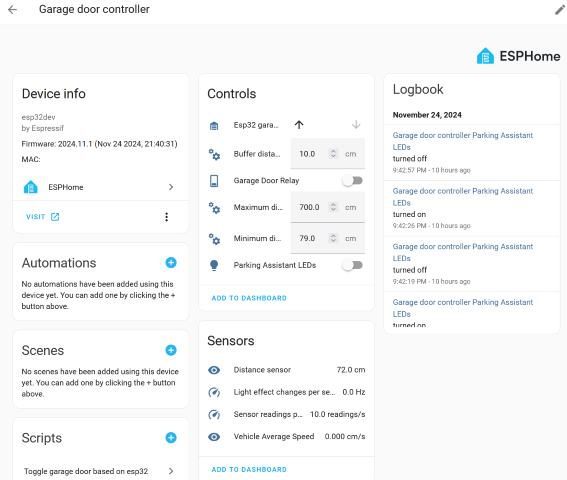

# John's ESPHome Devices
Welcome to my ESPhome configuration directory.  This repository contains the ESPhome devices I use in my home:

* [Garage Door Controller](http://...#garage-door-controller)

## <a name="garage-door-controller">Garage Door Controller</a>

### Features
* TFmini-S Sensor code to measure vehcile's distance from front of garage.  
* LED Strip to display green for pulling vehicle into garage, yellow to slow down, and red to stop.
* Sensor to read door open/close status.
* Relay to push garage door controller button to open/close garage door.
* 30 second timeout turns off LED lights after vehicle leaves or is parked.

### Files
| File                          | Description                     |
|-------------------------------|--------------------------------|
| [garage-door-controller.yaml](https://github.com/jdillenburg/esphome/blob/main/garage-door-controller.yaml)   | ESPHome Code for garage door controller                 |
| [TFmini.h](https://github.com/jdillenburg/esphome/blob/main/TFmini.h)                                         | Reads TFmini-S distance to car as a custom component    |

### Parts List
Links go to Amazon.com.
* [ESP32 Mini](https://www.amazon.com/gp/product/B07BK435ZW/ref=ppx_yo_dt_b_asin_image_o05_s00?ie=UTF8&psc=1)
* [TFmini-S](https://www.amazon.com/gp/product/B075V5TZRY/ref=ppx_yo_dt_b_asin_image_o01_s00?ie=UTF8&psc=1) - measures distance to vehicle
* [WS2812B LED Strip](https://www.amazon.com/gp/product/B01CDTEJBG/ref=ppx_yo_dt_b_search_asin_title?ie=UTF8&th=1) - only 1 meter needed
* [SRD-05VDC-SL-C](https://www.amazon.com/gp/product/B09G6H7JDT/ref=ppx_yo_dt_b_search_asin_title?ie=UTF8&psc=1) - 5V relay module to "push" door control button
* [CYT1070](https://www.amazon.com/gp/product/B073D4DJDC/ref=ppx_yo_dt_b_search_asin_title?ie=UTF8&psc=1) - Level shifter to convert ESP's 3.3V to LED Strip 5.0V
* 5V 2A Micro USB Power adapter to power ESP and LED Strip.
* [Magnetic door sensor](https://www.amazon.com/WESUA-Magnetic-Overhead-Contacts-Bracket/dp/B0BCYHBKVF?crid=3JFEWKWK89V1B&dib=eyJ2IjoiMSJ9.uJDdgjdeS3uEOsVaAps0i112QeIcTdBiISTaTjU41myRba5tAMceEsQTFUEHSmu07uQLz9wCZ7WUNuGEg1LKry18cc2nbD9lIAvBB-k77UImIj0fIZQKsXObVGPR76Z0j6lm5VDni9AUo5934nR9TjJOSm2XWZaltlVvvHNQMwmxcW8XvHVSbU4ZyTTBrzY98hJOFs0y425okmUaoITHpAzkdb2TDlGVS7U9sem-KoN--boaKqIfsh_DEr1JIsZNMtRlvHjhRkolxgLjXQ3vEAetyLac6D_zc9el6BPJbw4.D-wK21SM9Cq3gHdmdCxJqH47AkVhG9anOlfFXXv_axQ&dib_tag=se&keywords=5V+magnetic+garage+door+sensor&qid=1732491358&sprefix=5v+magnetic+garage+door+sensor%2Caps%2C141&sr=8-3) - there are hundreds of variants on Amazon, take your pick as long as it is normally open when the magnets are apart.

### Hook Up

1. (Optional) Solder pin headers to ESP32 Mini.  You will only need the inner most set of pins.  You can also solder connections directly to the ESP32 mini if desired.  I like to mount my parts on a Solderable breadboard, so pin headers are needed.
2. The TFminiS is connected to GPIO21 for RXD and GPIO22 for TXD.  The YAML file configures a UART where TXD on the ESP32 connects to RXD on the TFmini and ditto for RXD to TXD.  The TFminiS is powered via 5V.
3. The data line on the LED strip is connected to GPIO16 through the level shifter LV (low voltage) pin.  The YAML file configures an addressable light component on this pin.
4. Connect the 5V relay to the ESP32 GPIO17.  The other normally open (NO) end of the relay connects to your door opener's push button.  The YAML file configures the GPIO17 to trigger with a 500ms pulse.
5. Connect one wire from the door sensor to ground and the other wire to GPIO23 on the ESP32.

### Software Install

You can copy/paste the YAML code to your ESPHome device's file.  You'll need to skip over the "ap", "ota", and "wifi" sections to maintain your own secrets.  Or, alternatively, place the secrets and passwords into your own secrets.yaml file.

You will also need to upload the TFmini.h file to your Home Assistant config/esphome directory in order for the compilation to succeed.
